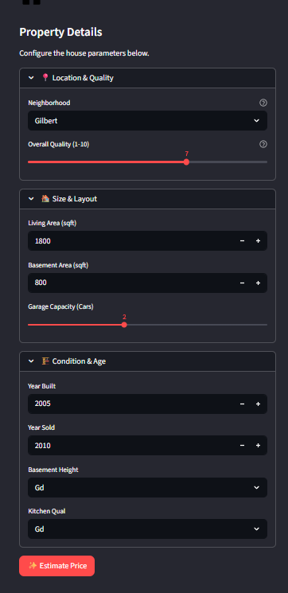
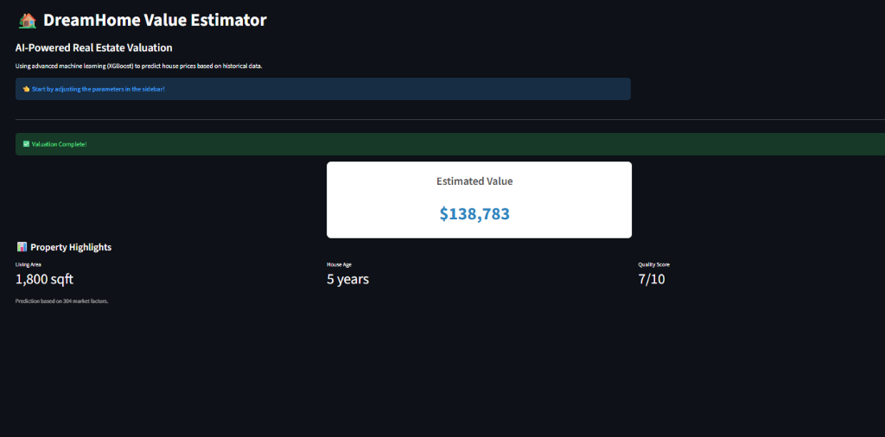

# House Price Prediction Web App 🏠

[](https://www.python.org/)
[](https://scikit-learn.org/)
[](https://xgboost.readthedocs.io/)
[](https://streamlit.io/)
[](https://www.kaggle.com/c/house-prices-advanced-regression-techniques)
[](https://opensource.org/licenses/MIT)

**Live Demo:** [House Price Predictor](https://your-house-price-app.streamlit.app/)  
_(Replace with your actual deployed link – Streamlit Cloud / HuggingFace Spaces / Render)_

An end-to-end **regression** Machine Learning project to predict residential house sale prices using the famous **Kaggle House Prices: Advanced Regression Techniques** dataset (79 explanatory variables, 1460 training samples).  
Built with **scikit-learn + XGBoost** for modeling and **Streamlit** for a clean, interactive web interface.

This project demonstrates advanced feature engineering, model comparison, hyperparameter tuning, ensemble techniques, and real-world deployment — perfect for showcasing regression skills in a portfolio.

## Project Overview

Predict the final sale price of homes in Ames, Iowa based on 79 features (numerical + categorical): lot size, quality, basement, garage, year built, neighborhood, etc.

Key focus areas:

- Heavy feature engineering & preprocessing (handling 30%+ missing values, outliers, interactions)
- Multiple regression models & ensemble
- Evaluation with RMSE (Kaggle competition metric)
- Interactive Streamlit app for user predictions

## Performance Summary

| Model                      | RMSE (Validation)  | R² Score       | Notes                            |
| -------------------------- | ------------------ | -------------- | -------------------------------- |
| Baseline Linear Regression | ~35,000–42,000     | ~0.78–0.82     | Simple starting point            |
| Ridge Regression           | ~28,000–33,000     | ~0.84–0.87     | Regularization helps overfitting |
| Lasso Regression           | ~27,000–32,000     | ~0.85–0.88     | Automatic feature selection      |
| Random Forest              | ~25,000–30,000     | ~0.87–0.90     | Good non-linear capture          |
| **XGBoost (Best)**         | **~22,000–26,000** | **~0.90–0.92** | Tuned & final model for app      |
| Stacking Ensemble          | ~21,000–24,000     | ~0.91–0.93     | Blending top models (optional)   |

_Lower RMSE = better prediction. Top 10–20% on Kaggle leaderboard possible with this setup._

## Key Highlights

- **Interactive Streamlit Web App**
  - Sidebar inputs for the most important features (OverallQual, GrLivArea, TotalBsmtSF, GarageCars, Neighborhood, YearBuilt, etc.)
  - Real-time price prediction with estimated range
  - Confidence visualization (progress bar or gauge)
  - Feature importance chart (Plotly)
  - Responsive & mobile-friendly design

- **Advanced Feature Engineering** (25+ transformations)
  - Missing value imputation (median/mode + indicator columns)
  - Log transformation on skewed targets/numerics (SalePrice, LotArea, GrLivArea)
  - Categorical encoding (one-hot, target/ordinal mapping)
  - New features: TotalSF, TotalBath, TotalPorchSF, Age, RemodAge, HasPool, Has2ndFloor
  - Interactions: OverallQual × GrLivArea, GarageCars × GarageArea
  - Outlier capping & rare category grouping

- **Models Used**
  - Linear models (Ridge, Lasso)
  - Tree-based: Random Forest, XGBoost (best performer)
  - Optional: Stacking ensemble

- **Evaluation Metrics**
  - RMSE (primary), MAE, R²
  - 5-fold cross-validation
  - Residual plots & prediction error distribution

- **Tech Stack**
  - Python 3.8+
  - scikit-learn, XGBoost
  - Pandas, NumPy
  - Matplotlib, Seaborn, Plotly
  - Streamlit (web app)
  - joblib (model serialization)

## Project Structure

```
house-prices-prediction/
├── src/
│   ├── app.py              # Streamlit web app
│   └── train.py            # Full training pipeline & model saving
├── requirements.txt        # Dependencies
├── models/                 # Saved trained models (.pkl)
│   └── xgboost_best.pkl
├── notebooks/              # Exploratory & modeling notebooks
│   └── house_prices_full_pipeline.ipynb
├── data/                   # Small sample data (full dataset from Kaggle)
├── assets/                 # README screenshots
└── README.md
```

## Quick Start

1. Clone the repository:

   ```bash
   git clone https://github.com/Khushi-Roy-123/house-prices-prediction.git
   cd house-prices-prediction
   ```

2. Install dependencies:

   ```bash
   pip install -r requirements.txt
   ```

3. Run the app locally:

   ```bash
   streamlit run src/app.py
   ```

   → Open http://localhost:8501

4. Retrain model (optional):
   ```bash
   python src/train.py
   ```

## How to Use the Web App

1. Enter key house features via the sidebar
2. Click **Predict Price**
3. View:
   - Estimated sale price
   - Confidence range
   - Top contributing features chart

## Screenshots

### House Price Prediction Interface



### Prediction Result & Confidence



### Feature Importance Chart

_(Add feature importance chart if available)_

<!--  -->

## Skills Demonstrated

- Advanced regression & feature engineering
- Model selection, hyperparameter tuning (GridSearchCV/RandomizedSearchCV)
- Handling high-dimensional, messy real-world data
- Ensemble methods & stacking
- Interactive web deployment with Streamlit
- Clean, modular code & documentation

## Future Enhancements

- Add SHAP/LIME explainability
- Batch prediction from uploaded CSV
- More advanced models (LightGBM, CatBoost, Neural Nets)
- Full Kaggle submission notebook
- Deploy on HuggingFace Spaces

## Acknowledgments

- Dataset: Kaggle House Prices Competition
- Built with ❤️ by Khushi Roy

Feel free to ⭐ this repo if it helps your learning journey!
